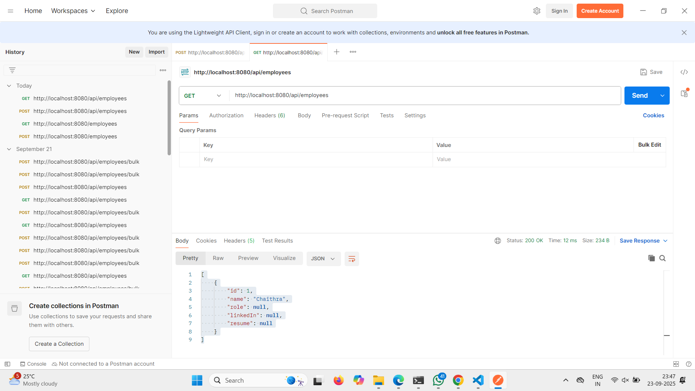

# Employee Management Spring Boot Project

## Description
A simple Employee Management application built with Spring Boot and Maven.  
Allows basic CRUD operations on Employee data: Create, Read, Update, Delete.

## Project Structure
em-project/
├─ src/
│ ├─ main/
│ │ │ ├─ java/org/codingwallah/em_project/
│ │ │ │ ├─ EmProjectApplication.java
│ │ │ │ ├─ Employee.java
│ │ │ │ └─ EmpController.java
│ │ └─ resources/
│ │ └─ application.properties
│ └─ test/
│ └─ java/org/codingwallah/em_project/
│ └─ EmProjectApplicationTests.java
├─ pom.xml
├─ README.md
└─ .gitignore

## Features
- Add new employees  
- View all employees  
- Update employee details  
- Delete employees  
- REST API endpoints

## Technologies Used
- Java 17  
- Spring Boot  
- Maven  
- REST API  
- VS Code / IntelliJ IDEA

## How to Run
1. Clone the repository:  
   ```bash
   git clone https://github.com/Chaithra24-shetty/em-project.git
2. Navigate to project folder:  
   ```bash
   cd em-project
3. Run with Maven:  
   ```bash
   mvn spring-boot:run
   ## Screenshot



## API Usage Examples

### Add Employee (POST)
POST http://localhost:8080/api/employees  
Body (JSON):
```json
{
  "id": 1,
  "name": "Chaithra",
  "role": "Java Developer",
  "linkedIn": "https://linkedin.com/in/chaithra",
  "resume": "resume.pdf"
}
### Get All Employees (GET)
GET http://localhost:8080/api/employees

### Update Employee (PUT)
PUT http://localhost:8080/api/employees/1  
Body (JSON):
```json
{
  "id": 1,
  "name": "Chaithra Shetty",
  "role": "Senior Java Developer",
  "linkedIn": "https://linkedin.com/in/chaithra",
  "resume": "resume_updated.pdf"
}
### Delete Employee (DELETE)
DELETE http://localhost:8080/api/employees/1
